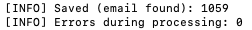
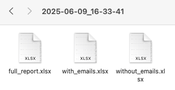
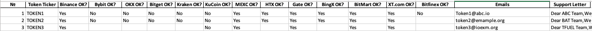
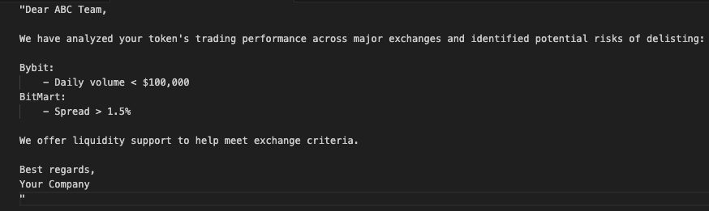

# 🛡️ Token Compliance Checker

## 🌟 What is it?

**Token Compliance Checker** is a powerful tool for crypto market makers, analysts, and token projects to:

* Analyze token compliance across major exchanges
* Detect delisting risks
* Collect contact information (email & Telegram) from public sources
* Generate ready-to-send outreach templates

---

### 🔍 What’s New?

Now, in addition to email parsing, the tool **extracts public Telegram usernames** of token teams.
⚡ This means you can reach out directly even if no email is available!

---

## 🚀 Key Features

🧠 **Background automation:** Contact data (emails & Telegrams) is cached and auto-refreshed periodically.

💡 Listing tier suggestions: For each underperforming token, the tool can propose listing upgrades (e.g., from Tier-3 to Tier-2 or Tier-1) and includes a message template offering strategic help.

* ✅ **Automatic delisting risk analysis**
* ✅ **Email and Telegram contact scraping**
* ✅ **Supports 13+ exchanges**: Binance, OKX, KuCoin, MEXC, Bitget, Kraken, and more
* ✅ **Flexible rules via `exchange_rules.json`**
* ✅ **Caching and automatic updates**
* ✅ **Excel report export (`.xlsx`)**
* ✅ **Zero cost, no API keys, no accounts required**
* ✅ **Email/Telegram template generation**

---

## 📈 Real Results

* 📩 Parses **thousands emails** and **Telegram usernames**
* 🎯 Finds up to **3,000 potential clients** per scan



---

## 📊 Output Reports (Now with Tier Insights & Unique Listings)

The tool generates multiple Excel reports to support different lead-generation and risk-detection strategies:

1. **Tokens with issues and contacts** — includes email, Telegram, and outreach message template
2. **Tokens with issues but no contact found** — for manual research or cold outreach
3. **Combined report** — full list of flagged tokens with and without contacts
4. **Unique Exchange Report** — highlights tokens listed only on a single exchange (a key delisting risk factor)

📁 Folder structure example (each report is saved in a date-named subdirectory):


📊 Example of token row with contact info:


✉️ Auto-generated email message template preview:



---

## 💻 Installation

```bash
# Requires Python >= 3.11
chmod +x setup.sh
./setup.sh
```

---

## ▶️ Usage

```bash
python token_checker.py --exchange Binance --limit 50 --output report.xlsx
```

**Arguments:**

* `--exchange`: exchange name (e.g., Binance)
* `--limit`: number of tokens to analyze
* `--output`: Excel file name for the report

---

## 📁 Project Structure

| File                  | Purpose                             |
| --------------------- | ----------------------------------- |
| `token_checker.py`    | Main analysis script                |
| `exchange_rules.json` | Exchange-specific compliance limits |
| `update_cache.py`     | Parses email and Telegram, caching  |
| `requirements.txt`    | Python dependencies                 |
| `setup.sh`            | Environment setup script            |

---

## 🔧 Extension Opportunities

* REST API or Telegram bot integration
* Auto email or DM dispatching
* Advanced filtering and scoring

---

## 📞 Contact

**🤖 Telegram Bot:** [@mm\_he1per\_bot](https://t.me/mm_he1per_bot?start=ref_840941043)
**📩 Email:** [cryptotyk@gmail.com](mailto:cryptotyk@gmail.com)
**📲 Telegram:** [@cryptotyk\_founder](https://t.me/cryptotyk_founder)

---

**License:** MIT
**Author:** Cryptotyk
