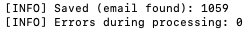
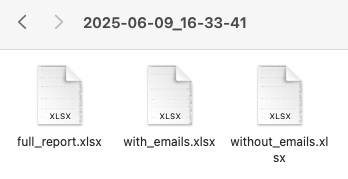
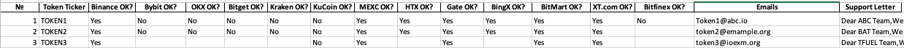
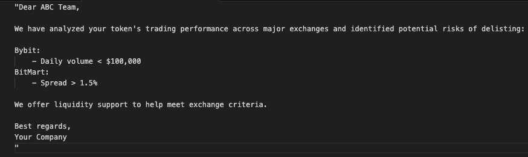

# 🛡️ Token Compliance Checker

## 🌟 What is it?

**Token Compliance Checker** is a powerful tool for crypto market makers, token projects, and analysts to assess token compliance with major exchanges and proactively detect delisting risks.

But it does more than just compliance checks:

* 📨 **Email parsing engine**: Collects and caches public contact emails of token projects.
* 🗂 **Smart caching system**: Stores contact data and project metadata locally to ensure lightning-fast performance — full multi-exchange token compliance check can take **just seconds**.
* 🔁 **Auto-updates**: The cache refreshes automatically on first use and can be updated regularly.
* 💸 **Zero monthly cost**: No API keys, no subscriptions, no premium accounts required.



---

## 🚀 Key Features

* ✅ **Automatic delisting risk analysis**
* ✅ **Public email scraping and contact generation**
* ✅ **Supports major exchanges**: Binance, OKX, KuCoin, MEXC, Bitget, Kraken, and more
* ✅ **Customizable rules via `exchange_rules.json`**
* ✅ **Excel report export (`.xlsx`)**
* ✅ **Simple setup and usage**



---

## 🛠 Supported Exchanges (as an example)

| Exchange | Min. Volume (USDT) | 30d Avg Volume | Max Spread (%) |
| -------- | ------------------ | -------------- | -------------- |
| Binance  | 200,000            | 50,000         | 1.5            |
| OKX      | 100,000            | 30,000         | 1.5            |
| KuCoin   | 60,000             | 25,000         | 1.5            |
| MEXC     | 50,000             | 20,000         | 1.5            |
| Bitget   | 80,000             | 25,000         | 1.5            |
| Kraken   | 50,000             | 20,000         | 1.5            |
| ...      | ...                | ...            | ...            |

See full list in [`exchange_rules.json`](exchange_rules.json).

---

## 💻 Installation

```bash
# Requires Python >= 3.11
chmod +x setup.sh
./setup.sh
```

---

## ▶️ Usage

```bash
python token_checker.py --exchange Binance --limit 50 --output report.xlsx
```

**Arguments:**

* `--exchange`: Exchange name (e.g., Binance)
* `--limit`: Number of tokens to analyze (default 100)
* `--output`: Output Excel file name (default: token\_compliance\_report.xlsx)

---

## 📁 Project Structure

| File                  | Purpose                             |
| --------------------- | ----------------------------------- |
| `token_checker.py`    | Main analysis script                |
| `exchange_rules.json` | Exchange-specific compliance limits |
| `update_cache.py`     | Token data cache and email fetcher  |
| `requirements.txt`    | Python dependencies                 |
| `setup.sh`            | Environment setup script            |

---

## 📊 Output Reports

When the analysis is complete, the tool generates up to **three Excel reports**:

1. **Tokens with issues and emails** — complete with a ready-to-send email template and list of deficiencies.
2. **Tokens with issues but no email found** — for manual outreach or extended parsing.
3. **Combined report** — full list of problematic tokens, with and without contact info.

Each report is stored in a timestamped folder for clear versioning.



📨 Each row with email includes a **pre-generated email draft** like this:



This makes the tool ideal for:

* Offering your services as a **market maker** or **liquidity provider**
* Scanning for struggling tokens that may need help
* Outreach campaigns to potential clients

---

## 🔧 Extension Opportunities

* Integrate into CI/CD pipelines
* REST API or Telegram bot
* Support for JSON/CSV exports
* Custom rules per token/sector

---

## 📞 Want a Demo or Custom Integration?

We can tailor the tool to your business needs.

**🤖 Telegram Bot:** [@mm_he1per_bot](https://t.me/mm_he1per_bot?start=ref_840941043))
**📩 Contact:** [cryptotyk@gmail.com](mailto:cryptotyk@gmail.com)
**📲 Telegram:** [@cryptotyk\_founder](https://t.me/cryptotyk_founder)

---

**License:** MIT

**Author:** Cryptotyk
